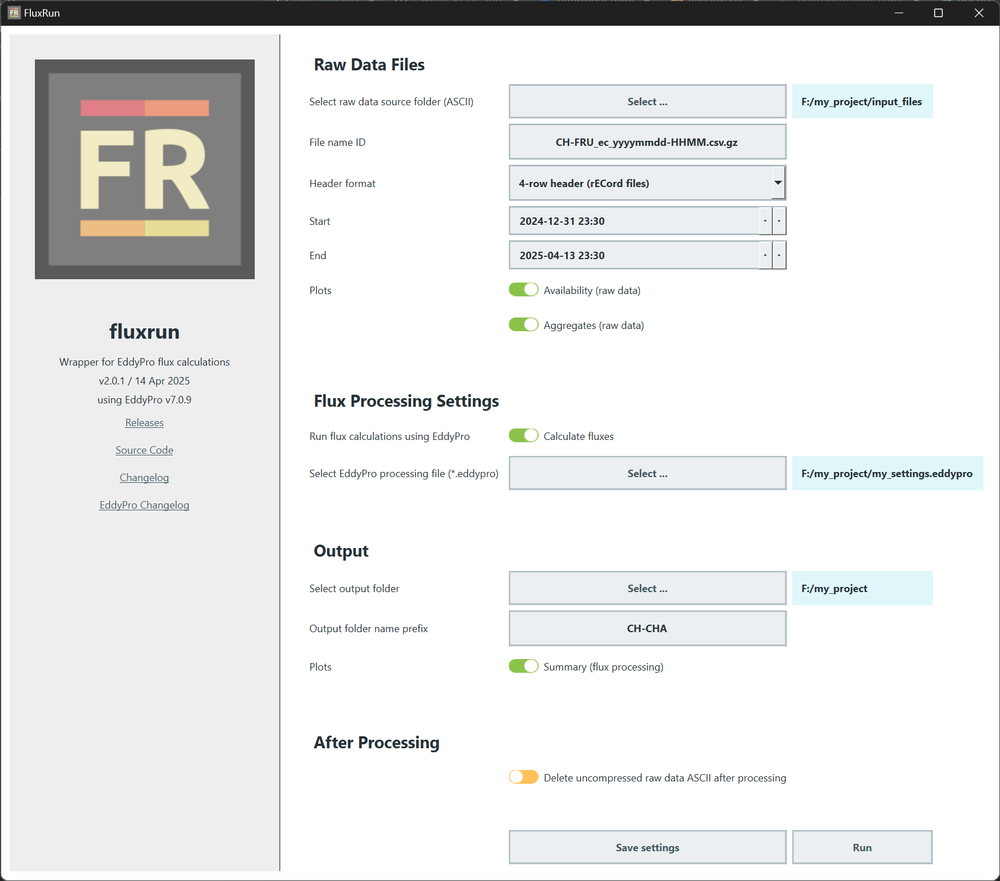

# fluxrun

Python wrapper for EddyPro to calculate eddy covariance (EC) ecosystem fluxes from raw data files.

`fluxrun` can be executed using the GUI or directly from the command line interface.

`fluxrun` was created as a wrapper around EddyPro. This means that the flux calculations are done by EddyPro, but
`fluxrun` adds some functionality, e.g.:

- `fluxrun` automatically creates an output folder structure, including run ID.
- The log output from EddyPro (together with other output from `fluxrun`) is stored to a log file.
- There is an additional log file storing warnings and errors.
- `fluxrun` can be executed in parallel, e.g. when calculating fluxes for multiple years `fluxrun` makes it a bit easier
  to run them all at once. Parallelization is not included by default (at the moment), but using the command-line
  interface multiple instances of `fluxrun` can be started quickly. Each started instance gets its own output folder and
  folder structure, including a unique run ID.
- Input files are validated to make sure columns contain numeric data only. Non-numeric data are converted to `-9999`.
- `fluxrun` can create several plots during processing: raw data availability, raw data aggregates and summary plots of
  all variables in EddyPro's `_full_output_` file.
- In case compressed files are used (`.gz`), the files are automatically uncompressed (text format) before processing.
  After processing,in case the uncompressed files are no longer needed, they can be automatically deleted. If the
  files have the file extension `.gz`, they are uncompressed before further processing.

### Description of GUI settings

#### Raw Data Files

- `Select raw data source folder (ASCII)`: Select source folder with eddy covariance (EC) raw data files
- `File name ID`: Define file name ID. The file name needs to contain datetime info, it needs info about the year,
  month, day, hours and minutes. Time info refers to the starting time of the file. Files are handled differently
  depending on the file extension. Files with the ending `.gz` will be umcompressed before processing. Files need to be
  text-based, e.g. CSV files, but they can be compressed as `.gz`. Example: SITE_yyyymmddHHMM.csv.gz
- `Header format`: Numer of header rows in the raw data files.
- `Start`: Define start date for processing, files before this date will be ignored.
- `End`: Define end date for processing, files after this date will be ignored.
- `Plots`:
    - `Availability (raw data)`: Plot data availablility based on the datetime info in the filenames.
    - `Aggregates (raw data)`: Plot aggregates (means) of the raw data.

#### Flux Processing Settings

- `Run flux calculation using EddyPro`: Select for flux calculations.
- `Select EddyPro processing file (*.eddypro)`: Select `.eddypro` settings file that contains the flux processing
  settings for EddyPro. `fluxrun` will search for a `.metadata` file of the same name in the same folder as the
  `.eddypro` file. For example, if the settings file is named `my_settings.eddypro`, then `fluxrun` needs a metadata
  file with the name `my_settings.metadata` in the same folder.

#### Output

- `Select output folder`: Select where to store the results. `fluxrun` automatically creates an output folder structure,
  including run ID for the main folder.
- `Output folder name prefix`: Prefix for the output folder, will be combined with the automatically generated run ID.
- `Plots`:
    - `Summary (flux processing)`: Simple overview plots generated for each variables in the `_full_output_` file from
      the EddyPro output.

#### After Processing

- `Delete uncompressed raw data ASCII after processing`: After processing, `fluxrun` can delete the uncompressed ASCII
  files. The uncompressed files are needed for flux calculations, but unless there is a desire to store the uncompressed
  files they are no longer needed. Only recommended if the input files were compressed (`.gz`).

### Installation

Installation is currently far from perfect, but here we go:

Using [miniconda](https://www.anaconda.com/docs/getting-started/miniconda/install#quickstart-install-instructions):

- Create conda environment with required Python version: `conda create -n fluxrun-env python=3.11`
- Activate the created environment: `conda activate fluxrun-env`
- Now check the fluxrun releases [here](https://github.com/holukas/fluxrun/releases) and decide which version to use
- Spot the `.tar.gz` file of the desired fluxrun version and use it to directly install from the GitHub repo via pip:
  `pip install https://github.com/holukas/fluxrun/archive/refs/tags/v2.1.0.tar.gz`
- Now all required dependencies are installed in the environment `fluxrun-env`
- With the `fluxrun-env` activated, to start the GUI (graphical user interface): `python -m fluxrun.main -g`
- With the `fluxrun-env` activated, to start processing with CLI (command-line interface):
  `python -m fluxrun.main -f C:\my_project -d 10`. When using the CLI, you basically point `fluxrun` to a folder and
  everything it needs to run it searches in that folder. Therefore, the folder `C:\my_project` needs to contain the
  `.eddypro` and `.metadata` files used by EddyPro, and in addition the file `fluxrunsettings.yaml`. The parameter
  `-d 10` means that only fluxes for the last 10 days are calculted. This parameter is useful when running `fluxrun` on
  an automatic schedule.
- Note: the `-m` parameter means that the script is executed as a module, i.e., the `fluxrun` version installed in the
  conda environment is called.
