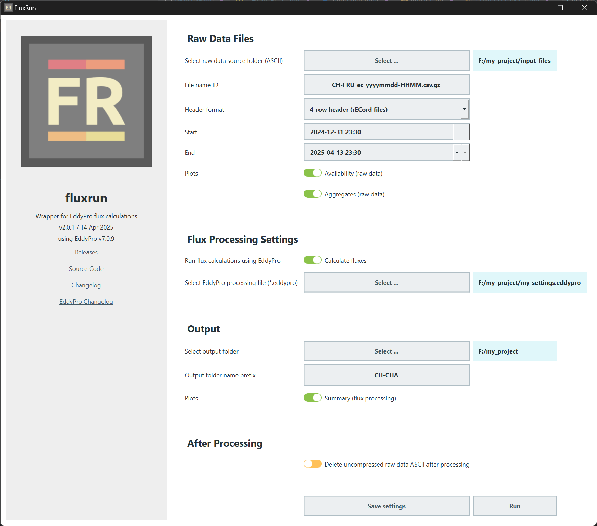

# fluxrun

Python wrapper for EddyPro to calculate eddy covariance (EC) ecosystem fluxes from raw data files.



`fluxrun` automates the calculation of ecosystem fluxes — the exchange of energy, CO₂, water vapor, and other
scalars between vegetation and the atmosphere — using the eddy covariance technique. It wraps
[EddyPro](https://www.licor.com/env/products/eddy_covariance/eddypro) (v7.0.9), which performs the actual flux
calculations, and adds file management, validation, visualization, and workflow automation on top.

`fluxrun` can be executed using the GUI or directly from the command line interface.

---

## Features

- **Automated output folder structure** with a unique run ID (`FR-YYYYMMdd-HHMMSS`) for every processing run.
- **Dual logging**: a main log file capturing all output, plus a separate warnings/errors log.
- **Parallel execution support**: multiple CLI instances can run simultaneously, each with its own output folder and run ID.
- **File validation**: raw data columns are checked for numeric content; non-numeric values are replaced with `-9999`.
- **Empty file detection**: files with 0 bytes are automatically skipped.
- **Compressed file support**: `.gz` files are automatically decompressed before processing and can be deleted afterwards.
- **Visualization**: raw data availability heatmaps, per-variable aggregate plots, and EddyPro full-output summary plots.
- **Date range filtering**: only files within the configured start/end date range are processed.

---

## Processing Pipeline

`fluxrun` orchestrates the following steps via `FluxRunEngine`:

1. **Setup** — Initialize logging, load settings from `fluxrunsettings.yaml`, prepare EddyPro processing and metadata files, create output folder structure.
2. **File search & filtering** — Discover raw data files matching the filename pattern; skip empty files; filter by date range.
3. **Decompression** — If input files have `.gz` extension, decompress them into the run output folder.
4. **Data validation** — Scan all raw files; replace non-numeric values (including `Infinity`, `#N/A`, `#NV`) with `-9999`.
5. **Raw data plots** *(optional)* — Generate availability heatmap and per-variable aggregate plots.
6. **Flux calculation** — Execute EddyPro Raw Processing (`eddypro_rp.exe`), then Flux Computation & Correction (`eddypro_fcc.exe`) if needed.
7. **Summary plots** *(optional)* — Generate multi-panel plots for each variable in the EddyPro `_full_output_` file.
8. **Cleanup** *(optional)* — Delete decompressed ASCII files if no longer needed.

---

## Output Folder Structure

Each run creates a uniquely named folder under the configured output directory:

```
{OUTDIR}/{OUTDIR_PREFIX}_{run_id}/
├── 0_log/
│   ├── {run_id}_main.log                    # All log messages
│   └── {run_id}_warnings_errors.log         # Warnings and errors only
│
├── 1-0_rawdata_files_ascii/
│   └── {uncompressed data files}            # Populated if input is .gz
│
├── 1-1_rawdata_plots_availability/
│   └── file_availability_heatmap.png        # If PLOT_RAWDATA_AVAILABILITY = 1
│
├── 1-2_rawdata_plots_aggregates/
│   └── {variable_name}_{units}.png          # If PLOT_RAWDATA_AGGREGATES = 1
│
├── 2-0_eddypro_flux_calculations/
│   ├── ini/
│   │   ├── processing.eddypro               # Updated EddyPro settings
│   │   └── {project}.metadata               # EddyPro metadata file
│   ├── bin/
│   │   ├── eddypro_rp.exe
│   │   └── eddypro_fcc.exe
│   └── results/
│       └── {project}_full_output_*.csv      # EddyPro flux results
│
└── 2-1_eddypro_flux_calculations_summary_plots/
    └── {ix}_{variable}_{units}.png          # If PLOT_SUMMARY = 1
```

The run ID format is `FR-YYYYMMdd-HHMMSS`, ensuring each run has a unique, timestamped identifier.

---

## GUI Settings

### Raw Data Files

- `Select raw data source folder (ASCII)`: Select source folder with eddy covariance (EC) raw data files.
- `File name ID`: Define file name ID. The file name must contain datetime info for year, month, day, hours, and
  minutes (start time of the file). Files with extension `.gz` are decompressed before processing. Example:
  `SITE_yyyymmddHHMM.csv.gz`
- `Header format`: Number of header rows in the raw data files.
- `Start`: Define start date for processing; files before this date are ignored.
- `End`: Define end date for processing; files after this date are ignored.
- `Plots`:
    - `Availability (raw data)`: Plot data availability based on datetime info in the filenames.
    - `Aggregates (raw data)`: Plot aggregates (medians, means) of the raw data per variable.

### Flux Processing Settings

- `Run flux calculation using EddyPro`: Enable flux calculations via EddyPro.
- `Select EddyPro processing file (*.eddypro)`: Path to the `.eddypro` settings file. A `.metadata` file of the
  same base name must exist in the same folder (e.g., `my_settings.eddypro` requires `my_settings.metadata`).

### Output

- `Select output folder`: Base directory for results. `fluxrun` creates a uniquely named subfolder per run.
- `Output folder name prefix`: Prefix for the output folder, combined with the auto-generated run ID.
- `Plots`:
    - `Summary (flux processing)`: Multi-panel overview plots for each variable in the EddyPro `_full_output_` file.

### After Processing

- `Delete uncompressed raw data ASCII after processing`: Delete uncompressed ASCII files after flux calculation.
  Only recommended when input files are `.gz` compressed. The last file is kept as a backup.

---

## Settings File Reference (`fluxrunsettings.yaml`)

When using the CLI, `fluxrun` reads all settings from a `fluxrunsettings.yaml` file in the project folder.

### RAWDATA

| Key | Type | Description |
|-----|------|-------------|
| `INDIR` | path | Folder containing the raw EC data files |
| `FILENAME_ID` | string | Filename pattern with datetime placeholders: `yyyy`, `mm`, `dd`, `HH`, `MM`. Example: `SITE_yyyymmdd-HHMM.csv.gz` |
| `HEADER_FORMAT` | string | `3-row header (bico files)` or `4-row header (rECord files)` |
| `START_DATE` | datetime | Processing start, format: `YYYY-MM-DD HH:MM` |
| `END_DATE` | datetime | Processing end, format: `YYYY-MM-DD HH:MM` |
| `PLOT_RAWDATA_AVAILABILITY` | 0 or 1 | Generate file availability heatmap |
| `PLOT_RAWDATA_AGGREGATES` | 0 or 1 | Generate per-variable aggregate plots |

### FLUX_PROCESSING

| Key | Type | Description |
|-----|------|-------------|
| `RUN_FLUX_CALCS` | 0 or 1 | Run EddyPro flux calculations |
| `EDDYPRO_PROCESSING_FILE` | path | Path to `.eddypro` settings file; `.metadata` file must be in the same folder |

### OUTPUT

| Key | Type | Description |
|-----|------|-------------|
| `OUTDIR` | path | Base output directory |
| `OUTDIR_PREFIX` | string | Prefix for the run output folder |
| `PLOT_SUMMARY` | 0 or 1 | Generate summary plots from EddyPro full output |

### AFTER PROCESSING

| Key | Type | Description |
|-----|------|-------------|
| `DELETE_UNCOMPRESSED_ASCII_AFTER_PROCESSING` | 0 or 1 | Delete uncompressed ASCII files after processing (recommended only for `.gz` input) |

### Example `fluxrunsettings.yaml`

```yaml
RAWDATA:
  INDIR: Y:/CH-CHA_Chamau/20_sonic_ghg/2025/10
  FILENAME_ID: CH-CHA_ec_yyyymmdd-HHMM.csv.gz
  HEADER_FORMAT: 4-row header (rECord files)
  START_DATE: 2025-10-05 00:00
  END_DATE: 2025-12-31 23:59
  PLOT_RAWDATA_AVAILABILITY: 1
  PLOT_RAWDATA_AGGREGATES: 1
FLUX_PROCESSING:
  RUN_FLUX_CALCS: 1
  EDDYPRO_PROCESSING_FILE: F:/projects/CH-CHA/CH-CHA_2025.eddypro
OUTPUT:
  OUTDIR: F:/projects/CH-CHA/output
  OUTDIR_PREFIX: CH-CHA
  PLOT_SUMMARY: 1
AFTER PROCESSING:
  DELETE_UNCOMPRESSED_ASCII_AFTER_PROCESSING: 1
```

---

## Generated Plots

### Availability Heatmap (`file_availability_heatmap.png`)

Shows file presence and size across the processed time period as a color-coded heatmap:
- X-axis: day of month (1–31)
- Y-axis: year-month (YYYY-MM)
- Color: file size in MB (missing days shown in light gray)

### Raw Data Aggregate Plots (`{variable}_{units}.png`)

One plot per variable across all raw data files:
- **Top panel**: Median value with 5th–95th percentile band, overlaid with mean ± std
- **Bottom panel**: Number of data points per file

### EddyPro Summary Plots (`{ix}_{variable}_{units}.png`)

One 6-panel plot per variable from the EddyPro `_full_output_` file:
1. **Time series** — line plot with 5th/95th percentile markers
2. **Daily average** — scatter with error bars (±std)
3. **Histogram** — value distribution
4. **Cumulative sum** — over the full period
5. **Diurnal cycle** — hourly average with std band
6. **Statistics box** — count, mean, std, min, max, percentiles

If a `qc_{variable}` column is present, only quality flags 0 and 1 are shown (quality 2 excluded).

---

## Data Validation & Edge Cases

| Situation | Behavior |
|-----------|----------|
| File is 0 bytes | Skipped automatically, logged as `[EMPTY FILE]` |
| File is `.gz` compressed | Auto-decompressed to run folder before processing |
| Non-numeric values in data | Replaced with `-9999` |
| Special missing value codes (`-9999`, `-6999`, `Infinity`, `#N/A`, `#NV`) | Treated as missing, not flagged |
| File outside date range | Skipped, logged as `[FILE TIME RANGE CHECK]` |
| No raw data files found | Processing exits with error code -1 |
| EddyPro RP produces full output | FCC step is skipped (not needed) |

---

## Dependencies

| Package | Version | Purpose |
|---------|---------|---------|
| `pandas` | ≥2.2.3, <3.0.0 | Data I/O and manipulation |
| `pyqt6` | ≥6.8.1, <7.0.0 | GUI framework |
| `matplotlib` | ≥3.10.1, <4.0.0 | Plot generation |
| `pyyaml` | ≥6.0.2, <7.0.0 | Settings file parsing |

Requires **Python ≥3.11, <3.12**.

---

## Installation

Using [miniconda](https://www.anaconda.com/docs/getting-started/miniconda/install#quickstart-install-instructions):

```bash
# Create and activate environment
conda create -n fluxrun-env python=3.11
conda activate fluxrun-env

# Install from GitHub (replace with desired version)
pip install https://github.com/holukas/fluxrun/archive/refs/tags/v2.1.1.tar.gz
```

All required dependencies are installed automatically.

**Start the GUI:**
```bash
python -m fluxrun.main -g
```

**Start CLI processing:**
```bash
python -m fluxrun.main -f C:\my_project -d 10
```

The `-d 10` parameter limits processing to the most recent 10 days — useful for scheduled/automated runs.

### CLI Project Folder Requirements

The folder passed to `-f` must contain:
```
C:\my_project\
├── fluxrunsettings.yaml       # fluxrun settings
├── my_settings.eddypro        # EddyPro processing settings
└── my_settings.metadata       # EddyPro metadata (same base name as .eddypro)
```

The `-m` flag tells Python to run `fluxrun` as an installed module from the active conda environment.
